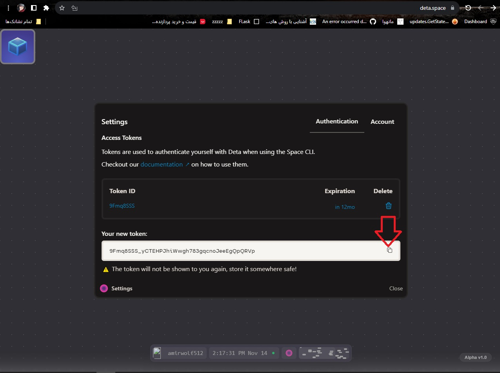

# Deta Terminal

Access to a Deta Micro's underlying command shell.

This app was created for debugging purposes, and just out of curiosity.

## Installation

#English:

Enter the site:
- [Date](http://deta.space/)

## Usage

Similar to how you would use a terminal app on your computer, you type commands and view the output.
For example, you can quickly test Python snippets with `python -c "code"` and view environment variables with `printenv`.
However, note that the Deta Micro runtime (essentially the AWS Lambda runtime) is very limited, so many commands and executables are not present.
Basic commands like `ls`, `cat`, and `echo` work, but things like `apt` and `curl` are not available.

## License

[MIT License](license.txt)
