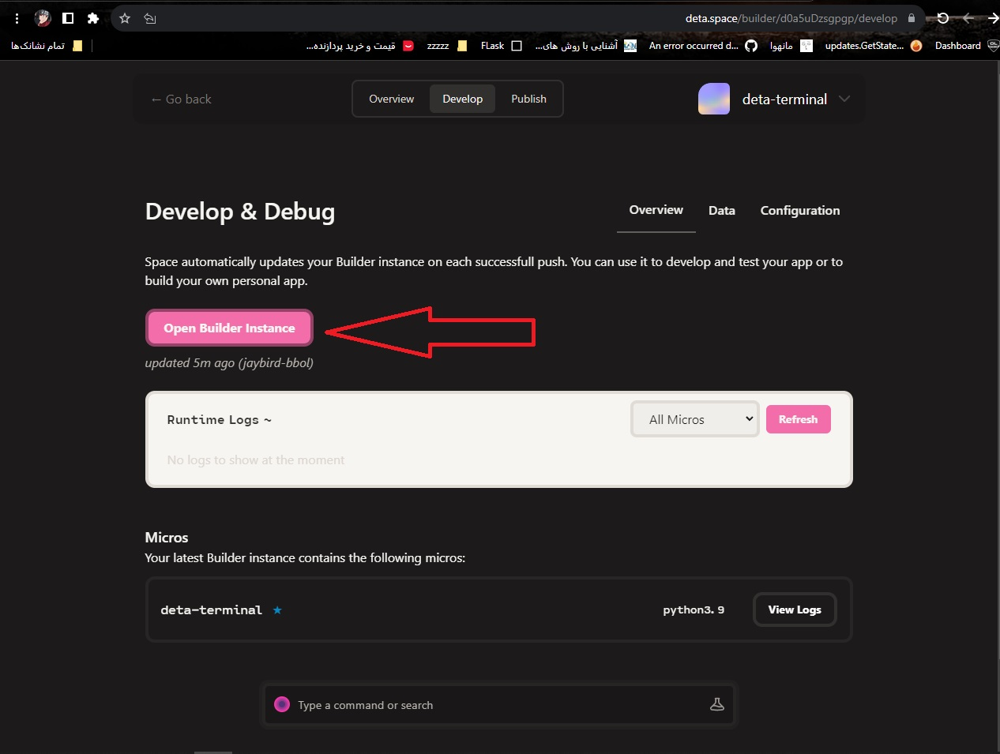

# Deta Terminal

Access to a Deta Micro's underlying command shell.

This app was created for debugging purposes, and just out of curiosity.

## Installation

## English:

=
Enter the site:- [deta.space](http://deta.space/)
=

=
This is your token, save somewhere
=

=
name:
TOKEN
It must be written
=
In the Secret section, enter the token you got from the deta.space site
=
Enter add secret
=

=
Enter the site:- [deta.space/builder](https://deta.space/builder/)
=

=
Well, it's over:)
=
## فارسی:

=
وارد سایت شوید:- [deta.space](http://deta.space/)
=

=
این توکن شماست یک جای سیو کنید
=

=
اسم:
TOKEN
باید وارد کنید
=
قسمت Secret توکنی که از سایت deta.space گرفتید وارد کنید
=
add secret بزنید
=

=
وارد سایت بشید:- [deta.space/builder](https://deta.space/builder/)
=

=
خب تموم شد:)
=
## Usage

Similar to how you would use a terminal app on your computer, you type commands and view the output.
For example, you can quickly test Python snippets with `python -c "code"` and view environment variables with `printenv`.
However, note that the Deta Micro runtime (essentially the AWS Lambda runtime) is very limited, so many commands and executables are not present.
Basic commands like `ls`, `cat`, and `echo` work, but things like `apt` and `curl` are not available.

## License

[MIT License](license.txt)
